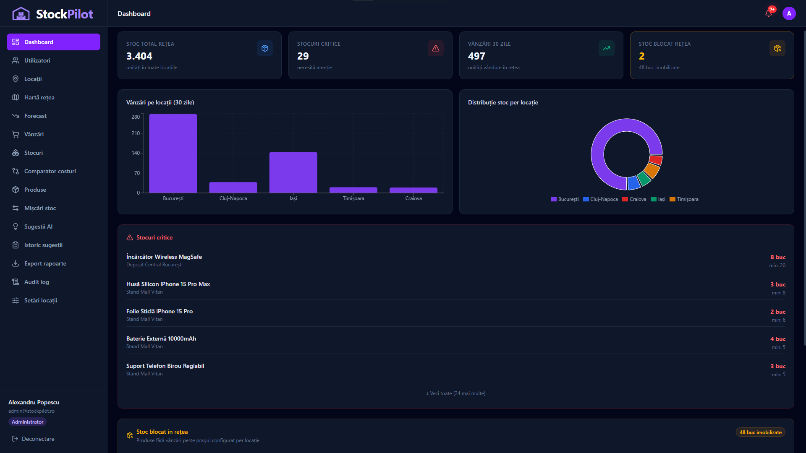
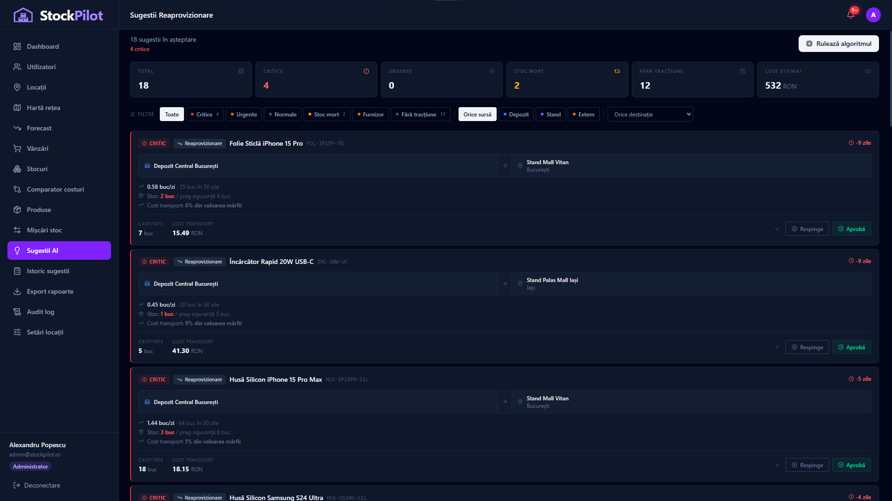
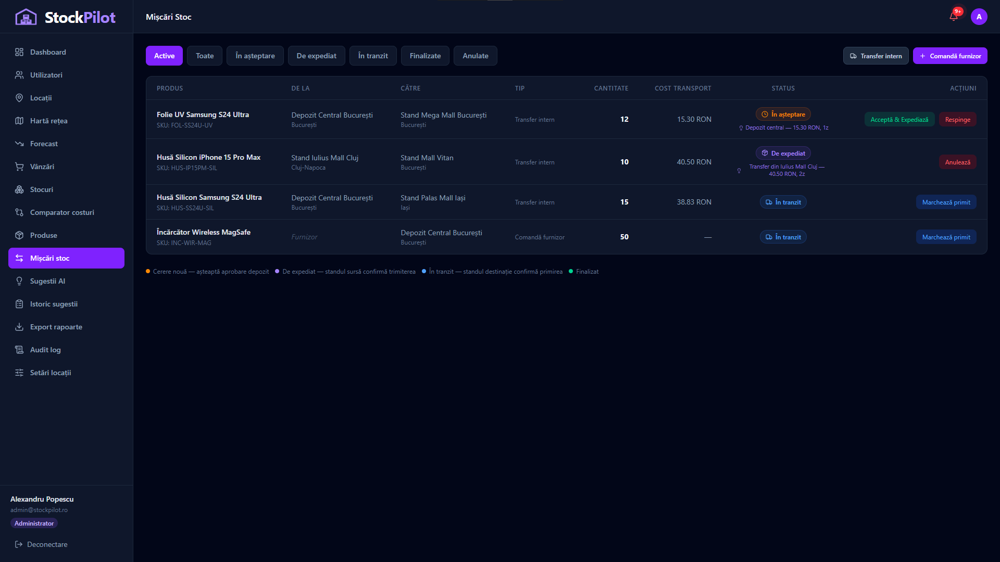
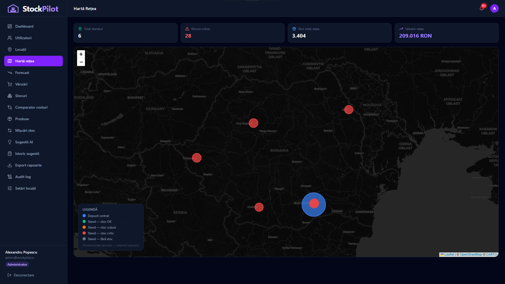
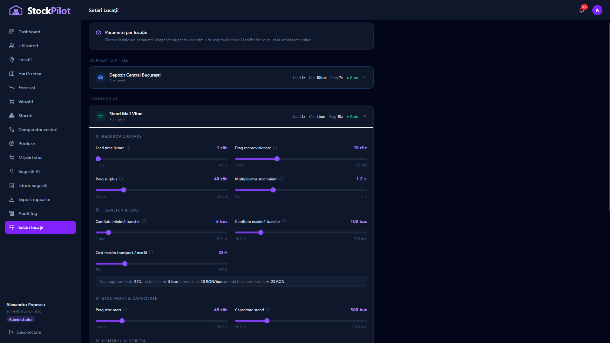

<div align="center">


# StockPilot

**Multi-location inventory management with AI-powered restocking suggestions**

[](https://react.dev)
[](https://www.typescriptlang.org)
[](https://nodejs.org)
[](https://expressjs.com)
[](https://supabase.com)
[](https://tailwindcss.com)
[](https://vitejs.dev)

[Features](#-features) · [Preview](#-preview) · [Architecture](#-architecture) · [Algorithm](#-restocking-algorithm) · [Getting Started](#-getting-started) · [API](#-api-reference) · [Team](#-team)

</div>

---

## 📖 Overview

StockPilot is a full-stack inventory and sales management platform built for **multi-location retail networks** — warehouses and field stands. It gives warehouse managers and stand operators real-time stock visibility, intelligent restocking recommendations, and a complete audit trail through a clean, role-aware interface.

The core of the system is a **weighted-sales-rate algorithm** that continuously analyzes stock levels, sales velocity, and transport costs across all locations to generate actionable, economically-sound transfer and reorder suggestions.

---

## 🖥 Preview

<!-- Replace the path below with an actual screenshot of the main dashboard -->


<details>
<summary>📸 More screenshots</summary>
<br>

| View | Screenshot |
|---|---|
| **AI Suggestions** — generated restocking recommendations with urgency tags |  |
| **Stock Movements** — full lifecycle workflow with status tracking |  |
| **Network Map** — geographic stock distribution via Leaflet |  |
| **Settings** — per-location algorithm tuning parameters |  |

</details>

---

## ✨ Features

### 🔁 Stock Movement Workflow
Full lifecycle management for every inventory movement:

```
pending → awaiting_pickup → in_transit → completed
                                       ↘ cancelled
```

- **Warehouse-initiated transfers** — direct dispatch from warehouse stock
- **Stand-to-stand redistribution** — surplus stands fulfill deficit stands
- **Supplier orders** — escalated automatically when network stock is insufficient
- **Manual movements** — warehouse managers can create transfers and orders directly
- Role-gated actions: warehouse managers approve, stand managers confirm pickup/delivery

### 💡 AI Restocking Suggestions
The algorithm runs on-demand and generates a fresh, deduplicated suggestion set:

| Flow | Trigger | Action |
|---|---|---|
| **Deficit** | Stock will run out before next resupply | Transfer from best source or escalate to supplier |
| **Stale redistribution** | Product stagnant > threshold, another stand has demand | Redistribute to active stand |
| **No traction** | Product never sold at this stand | Return to warehouse |
| **Surplus** | Stock covers > 100 days of demand | Source for deficit stands |

Every suggestion includes urgency tagging (`[CRITIC]` / `[URGENT]` / `[NORMAL]`), transport cost ratio, savings vs. warehouse reference cost, and full decision context stored as structured JSON.

### 📊 Analytics & Visibility
- Real-time dashboards per role (admin, warehouse manager, stand manager)
- Sales charts with date range filters
- Stale stock detection with configurable thresholds
- Cost comparison between supplier and internal transfer options
- Network map (Leaflet) showing stock distribution geographically
- Suggestion history with decision-time context preserved

### 🔐 Role-Based Access Control
| Feature | Admin | Warehouse Manager | Stand Manager |
|---|:---:|:---:|:---:|
| User management | ✅ | — | — |
| Audit log | ✅ | — | — |
| AI suggestions | ✅ | ✅ | — |
| Approve movements | ✅ | ✅ | — |
| Confirm pickup/delivery | — | — | ✅ |
| View own stock/sales | ✅ | ✅ | ✅ |

---

## 🏗 Architecture

```
stockpilot/
├── stockpilot-frontend/
│   └── src/
│       ├── components/        # Reusable UI (Header, layout)
│       ├── context/           # AuthContext, NotificationsContext
│       ├── pages/             # Suggestions, Movements, Settings, ...
│       └── services/
│           └── api.ts         # Typed API client (all endpoints)
│
└── stockpilot-backend/
    └── src/
        ├── config/            # Supabase client
        ├── middleware/        # authenticate, authorize (JWT + roles)
        ├── routes/            # suggestions, movements, stock, users, ...
        └── services/
            ├── algorithm.js   # Restocking suggestion engine
            └── audit.js       # Audit log helper
```

### Database Schema

<details>
<summary>📋 Key tables (click to expand)</summary>
<br>

| Table | Purpose |
|---|---|
| `locations` | Warehouses and stands (lat/lng, city, type) |
| `products` | Product catalog (SKU, unit_price, weight_kg) |
| `stock` | Current qty + safety_stock per location × product |
| `sales` | Historical sales events with timestamps |
| `stock_movements` | Full movement lifecycle with status transitions |
| `reorder_suggestions` | Algorithm output with structured reason JSON |
| `location_settings` | Per-location algorithm tuning parameters |
| `transport_costs` | fixed_cost + cost_per_kg + lead_time per route |
| `audit_logs` | Immutable action history |

<details>
<summary>🔎 Full SQL definitions</summary>

```sql
-- locations
create table public.locations (
  id serial not null,
  name character varying(100) not null,
  type character varying(20) not null,       -- 'warehouse' | 'stand'
  city character varying(100) not null,
  address character varying(255) null,
  lat numeric(9, 6) null,
  lng numeric(9, 6) null,
  created_at timestamp without time zone null default now(),
  constraint locations_pkey primary key (id),
  constraint locations_type_check check (
    (type)::text = any (array['warehouse', 'stand']::text[])
  )
);

-- products
create table public.products (
  id serial not null,
  name character varying(150) not null,
  sku character varying(50) not null,
  category character varying(100) null,
  unit_price numeric(10, 2) not null,
  weight_kg numeric(8, 3) null,
  created_at timestamp without time zone null default now(),
  constraint products_pkey primary key (id),
  constraint products_sku_key unique (sku)
);

-- stock
create table public.stock (
  id serial not null,
  location_id integer not null,
  product_id integer not null,
  quantity integer not null default 0,
  safety_stock integer not null default 5,
  updated_at timestamp without time zone null default now(),
  constraint stock_pkey primary key (id),
  constraint stock_location_id_product_id_key unique (location_id, product_id),
  constraint stock_location_id_fkey foreign key (location_id) references locations (id),
  constraint stock_product_id_fkey foreign key (product_id) references products (id)
);

-- sales
create table public.sales (
  id serial not null,
  location_id integer not null,
  product_id integer not null,
  quantity integer not null,
  sold_at timestamp without time zone null default now(),
  constraint sales_pkey primary key (id),
  constraint sales_location_id_fkey foreign key (location_id) references locations (id),
  constraint sales_product_id_fkey foreign key (product_id) references products (id)
);

-- stock_movements
create table public.stock_movements (
  id serial not null,
  product_id integer not null,
  from_location_id integer null,
  to_location_id integer not null,
  quantity integer not null,
  movement_type character varying(30) not null,  -- 'transfer' | 'supplier_order' | 'adjustment'
  status character varying(20) null default 'pending',
  transport_cost numeric(10, 2) null,
  notes text null,
  created_at timestamp without time zone null default now(),
  completed_at timestamp without time zone null,
  recommendation_reason text null,
  recommended_lead_time integer null,
  accepted_at timestamp without time zone null,
  picked_up_at timestamp without time zone null,
  constraint stock_movements_pkey primary key (id),
  constraint stock_movements_from_location_id_fkey foreign key (from_location_id) references locations (id),
  constraint stock_movements_product_id_fkey foreign key (product_id) references products (id),
  constraint stock_movements_to_location_id_fkey foreign key (to_location_id) references locations (id),
  constraint stock_movements_movement_type_check check (
    (movement_type)::text = any (array['transfer', 'supplier_order', 'adjustment']::text[])
  ),
  constraint stock_movements_status_check check (
    (status)::text = any (array['pending', 'awaiting_pickup', 'in_transit', 'completed', 'cancelled']::text[])
  )
);

-- reorder_suggestions
create table public.reorder_suggestions (
  id serial not null,
  product_id integer not null,
  from_location_id integer null,
  to_location_id integer not null,
  suggested_qty integer not null,
  reason text null,
  estimated_cost numeric(10, 2) null,
  status character varying(20) null default 'pending',  -- pending | approved | rejected | superseded
  created_at timestamp without time zone null default now(),
  updated_at timestamp without time zone null default now(),
  constraint reorder_suggestions_pkey primary key (id),
  constraint reorder_suggestions_from_location_id_fkey foreign key (from_location_id) references locations (id),
  constraint reorder_suggestions_product_id_fkey foreign key (product_id) references products (id),
  constraint reorder_suggestions_to_location_id_fkey foreign key (to_location_id) references locations (id),
  constraint reorder_suggestions_status_check check (
    (status)::text = any (array['pending', 'approved', 'rejected', 'superseded']::text[])
  )
);

create trigger reorder_suggestions_updated_at
  before update on reorder_suggestions
  for each row execute function set_updated_at();

-- location_settings
create table public.location_settings (
  id serial not null,
  location_id integer not null,
  lead_time_days integer not null default 2,
  safety_stock_multiplier numeric(4, 2) not null default 1.0,
  reorder_threshold_days integer not null default 7,
  surplus_threshold_days integer not null default 45,
  max_transfer_qty integer not null default 100,
  auto_suggestions boolean not null default true,
  notes text null,
  updated_at timestamp without time zone null default now(),
  updated_by character varying(100) null,
  stale_days_threshold integer not null default 60,
  storage_capacity integer not null default 9999,
  min_transfer_qty integer not null default 5,
  max_transport_cost_ratio numeric(4, 2) not null default 0.25,
  constraint location_settings_pkey primary key (id),
  constraint location_settings_location_id_key unique (location_id),
  constraint location_settings_location_id_fkey foreign key (location_id) references locations (id) on delete cascade
);

-- transport_costs
create table public.transport_costs (
  id serial not null,
  from_location_id integer not null,
  to_location_id integer not null,
  cost_per_kg numeric(8, 2) not null,
  fixed_cost numeric(8, 2) not null,
  lead_time_days integer not null,
  constraint transport_costs_pkey primary key (id),
  constraint transport_costs_from_location_id_to_location_id_key unique (from_location_id, to_location_id),
  constraint transport_costs_from_location_id_fkey foreign key (from_location_id) references locations (id),
  constraint transport_costs_to_location_id_fkey foreign key (to_location_id) references locations (id)
);

-- users
create table public.users (
  id serial not null,
  name character varying(100) not null,
  email character varying(150) not null,
  password character varying(255) not null,
  role character varying(50) not null,       -- 'admin' | 'warehouse_manager' | 'stand_manager'
  location_id integer null,
  created_at timestamp without time zone null default now(),
  constraint users_pkey primary key (id),
  constraint users_email_key unique (email),
  constraint users_location_id_fkey foreign key (location_id) references locations (id) on delete set null,
  constraint users_role_check check (
    (role)::text = any (array['admin', 'warehouse_manager', 'stand_manager']::text[])
  )
);

-- audit_logs
create table public.audit_logs (
  id serial not null,
  user_id integer null,
  user_name character varying(100) null,
  user_email character varying(150) null,
  user_role character varying(50) null,
  action character varying(50) not null,
  entity character varying(50) not null,
  entity_id integer null,
  description text not null,
  metadata jsonb null,
  ip_address character varying(45) null,
  created_at timestamp without time zone null default now(),
  constraint audit_logs_pkey primary key (id),
  constraint audit_logs_user_id_fkey foreign key (user_id) references users (id) on delete set null
);

create index idx_audit_logs_created_at on public.audit_logs using btree (created_at desc);
create index idx_audit_logs_user_id on public.audit_logs using btree (user_id);
create index idx_audit_logs_entity on public.audit_logs using btree (entity);
create index idx_audit_logs_action on public.audit_logs using btree (action);
```

</details>

</details>

---

## 🧠 Restocking Algorithm

The suggestion engine (`services/algorithm.js`) runs in several steps:

1. **Weighted sales rate** — 3-window weighted average (30/60/90 days, weights 0.5/0.3/0.2) gives more importance to recent demand without ignoring seasonal patterns
2. **Classify each stand** — deficit, surplus, stale, or no-traction per product
3. **Flow A (deficit)** — finds best source: surplus stand → stale stand → warehouse → supplier. Filters by ROI: transport cost must be ≤ `max_transport_cost_ratio` (default 25%) of merchandise value. CRITIC urgency (< 2 days stock) bypasses ROI check.
4. **Flow B (stale redistribution)** — moves stagnant stock to stands with proven demand
5. **Flow C (no traction)** — returns never-sold stock to warehouse
6. **Deduplication** — one suggestion per `product × source × destination` key; skips if an identical active movement already exists
7. **Full replacement** — on each run, all previous `pending` suggestions become `superseded` and the fresh set is inserted, ensuring the list always reflects current reality

**Configurable per location:**
`lead_time_days` · `safety_stock_multiplier` · `reorder_threshold_days` · `surplus_threshold_days` · `min_transfer_qty` · `max_transfer_qty` · `max_transport_cost_ratio` · `stale_days_threshold` · `storage_capacity`

---

## 🚀 Getting Started

### Prerequisites

- **Node.js** ≥ 18.0
- **npm** ≥ 9.0
- A [Supabase](https://supabase.com) project with the schema applied

### 1. Clone

```bash
git clone https://github.com/PaulSburlea/stockpilot
cd stockpilot
```

### 2. Backend

```bash
cd stockpilot-backend
npm install
cp .env.example .env   # .env.example is already in the repo
```

```env
# .env
SUPABASE_URL=https://your-project.supabase.co
SUPABASE_SECRET_KEY=your-service-role-key
JWT_SECRET=your-jwt-secret
PORT=3000
```

### 3. Frontend

```bash
cd ../stockpilot-frontend
npm install
cp .env.example .env
```

```env
# .env
VITE_API_URL=http://localhost:3000/api
```

### 4. Run

```bash
# Terminal 1
cd stockpilot-backend && npm run dev

# Terminal 2
cd stockpilot-frontend && npm run dev
```

Open [http://localhost:5173](http://localhost:5173)

### Database Setup

The SQL schema and seed data live in [`stockpilot-backend/supabase_migrations/`](stockpilot-backend/supabase_migrations/).  

---

## 📡 API Reference

All endpoints require `Authorization: Bearer <token>` unless noted.

| Method | Path | Auth | Description |
|---|---|---|---|
| `POST` | `/api/auth/login` | — | Login, returns JWT |
| `GET` | `/api/suggestions` | ✅ | List pending suggestions |
| `POST` | `/api/suggestions/run` | warehouse+ | Run restocking algorithm |
| `PATCH` | `/api/suggestions/:id` | warehouse+ | Approve or reject suggestion |
| `GET` | `/api/suggestions/history` | ✅ | Approved/rejected history |
| `GET` | `/api/movements` | ✅ | List movements (filtered by role) |
| `POST` | `/api/movements` | warehouse+ | Create manual movement |
| `PATCH` | `/api/movements/:id/accept` | warehouse+ | Accept → in_transit or awaiting_pickup |
| `PATCH` | `/api/movements/:id/pickup` | stand | Confirm dispatch from source stand |
| `PATCH` | `/api/movements/:id/receive` | stand/warehouse | Confirm receipt, update stock |
| `PATCH` | `/api/movements/:id/cancel` | role-gated | Cancel pending/awaiting movement |
| `GET` | `/api/stock` | ✅ | Stock levels across locations |
| `GET` | `/api/settings/:locationId` | ✅ | Location algorithm settings |
| `PUT` | `/api/settings/:locationId` | warehouse+ | Update location settings |
| `GET` | `/api/audit` | admin | Full audit log |
| `GET` | `/api/users` | admin | User list |

---

## 🤝 Contributing

1. Get `.env` values from a team member — **never commit secrets**
2. Pull latest before starting:
   ```bash
   git pull origin main
   ```
3. Create a feature branch:
   ```bash
   git checkout -b feature/your-feature-name
   ```
4. Commit with conventional format:
   ```bash
   git commit -m "feat: add stock movement filter by date range"
   git commit -m "fix: algorithm skips suggestions covered by active movements"
   git commit -m "chore: update location_settings defaults"
   ```
5. Open a pull request for review before merging to `main`

### Troubleshooting

| Issue | Solution |
|---|---|
| `EADDRINUSE` port 3000 | Change `PORT` in `.env` or kill the existing process |
| API calls return `401` | Token expired — log in again |
| `Connection refused` on API | Ensure backend is running and `VITE_API_URL` is correct |
| Supabase `permission denied` | Use the **service role** key in backend, not the anon key |
| Suggestions not appearing | Run the algorithm from the Suggestions page first |

---

## 👥 Team

<table>
  <tr>
    <td align="center">
      <a href="https://github.com/PaulSburlea">
        <br />
        <sub><b>Paul Sburlea</b></sub>
      </a>
    </td>
    <td align="center">
      <a href="https://github.com/visa-daniel-30123">
        <br />
        <sub><b>Daniel Vișa</b></sub>
      </a>
    </td>
  </tr>
</table>

---

<div align="center">
  <sub>Built with ☕ and way too many git conflicts</sub>
</div>